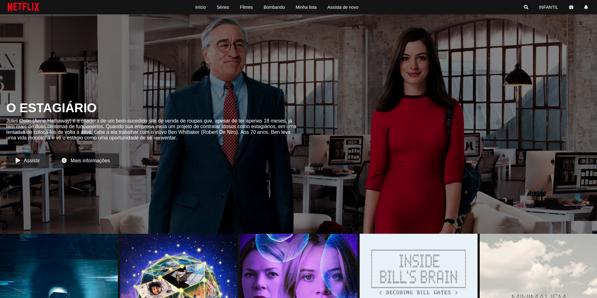

# Criação de uma página clone MVP do Netflix
Nesse projeto foi utilizado conceitos de CSS Flexbox, responsividade, boas práticas com html, container e o plugin Owl Carousel do jQuery. Desafio proposto pelo bootcamp Everis.

### Material de apoio:

* [HTML](https://www.w3schools.com/html/)
* [CSS](https://developer.mozilla.org/pt-BR/docs/Web/CSS)
